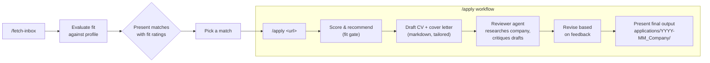

<p align="center">
  
</p>

# AI Job Search

An AI-powered job application framework built on [Claude Code](https://claude.com/claude-code). Set up your profile, monitor Gmail for curated job alerts, evaluate roles with AI agents, and apply to high-fit positions with tailored markdown CVs and cover letters.

## What this is

A structured workflow that turns Claude Code into a full-stack job application assistant. The system monitors Gmail for job alerts from LinkedIn and Indeed (no job-board scraping — Gmail's own alert filtering does that job), evaluates each posting against your profile, and orchestrates a drafter-reviewer pipeline for applications.



`/fetch-inbox` polls Gmail for LinkedIn/Indeed alert emails, fetches the full job description for each posting URL, and queues everything in `data/inbox_queue.json`. Fit evaluation happens twice: a quick pass during `/fetch-inbox` so you can see what's worth looking at, and a full pass at the top of `/apply` before any drafting starts. The framework encodes career guidance best practices, including structured evaluation criteria, forward-looking cover letter framing, and optional salary benchmarking.

## Prerequisites

- [Claude Code](https://claude.com/claude-code) (CLI)
- Python 3.10+
- Gmail account with job alert subscriptions (LinkedIn, Indeed)

### If you plan to publish or open-source your fork

This repo as committed is the maintainer's own working profile, not a scrubbed template — publishing it as-is publishes that data. Before making a fork public, scrub or exclude:

- `CLAUDE.md` — full candidate profile
- `data/profile.md` — candidate profile source of truth
- `.claude/skills/job-application-assistant/01-candidate-profile.md` — structured profile data
- `cv/*.md` — per-application tailored resumes
- `applications/` — generated CV/cover-letter output per application
- `job_search_tracker.csv` — application tracking spreadsheet
- `documents/` — source materials (CV, LinkedIn export, diplomas, references)
- `config.local.json`, `credentials.json`, `data/token.json` — already gitignored, but carry real credentials/PII, so call them out explicitly too

## Quick start

### 1. Clone

```bash
git clone https://github.com/iourichadour/ai-job-search-private.git
cd ai-job-search-private
```

### 2. Set up your profile

```bash
claude
# Then inside Claude Code:
/setup
```

`/setup` offers three paths: read your `documents/` folder if you have one populated (CV PDF, LinkedIn export, diplomas, reference letters, past applications), import a single CV pasted in chat, or walk through an interview. It auto-detects what you have and asks. Documents-folder mode is idempotent and safe to re-run as you add more material; see `documents/README.md` for the layout.

### 3. Monitor job alerts

```bash
/fetch-inbox
```

This polls your Gmail inbox for unread job alerts from LinkedIn and Indeed, fetches the full job descriptions, and presents them with quick fit assessments. High-fit matches are queued for review.

### 4. Apply to a job

```bash
/apply https://www.linkedin.com/jobs/view/1234567890/
```

If the URL can't be fetched, you can paste the job description directly instead:

```bash
/apply <paste the full job description here>
```

This runs the full workflow: evaluate fit, draft a markdown CV + cover letter, review with a second agent, revise, and present the final output in `applications/YYYY-MM_Company/`.

## Other commands

`/fetch-inbox`, `/apply`, and manual job tracking form the core workflow. Additional commands extend it:

- **`/expand`** enriches your profile by scanning public sources you've already linked in it (GitHub repos, portfolio site, Kaggle, Google Scholar) and looking up syllabi for named courses and certifications. Discovered competencies are added to your profile with a source tag. Useful right after `/setup` to surface skills that documents alone don't make explicit.
- **`/upskill`** analyzes the gap between your profile and your tracked job postings (or a single posting via `/upskill <URL>`). Produces a prioritized heatmap of skill gaps and a learning plan with web-searched study resources and time estimates. Useful for career planning between applications.

`/reset` is also available, see [Starting over](#starting-over) below.

## Dashboard: review tracking

```bash
python tools/generate_mockup.py
```

Generates `_brief/mockup.html` — a single-file dashboard computed live from `data/job_evaluations.json` and `job_search_tracker.csv`. Three tabs: Executive Landing (KPIs, top high-fit roles, fit-category donut, tech-stack alignment), 5-Dimension Fit Analytics (per-dimension averages, skill-gap explorer), and Application Funnel (your actual tracked applications, in-progress count, response rate). Open the generated file directly in a browser, or serve it locally (`python -m http.server` from `_brief/`) if your browser blocks `file://` script execution. Re-run the script any time to refresh — it doesn't watch the underlying files.

This is an interim tool; a fuller live-reloading, two-page dashboard with applied-jobs-to-evaluation matching is planned in `openspec/changes/eval-dashboard/` (not yet implemented).

## File structure

> **Cleanup in progress.** The tree below is the target structure for the current workflow. A few things still on disk today aren't shown here because they're pending removal or a decision — see [Repo cleanup: pending review](#repo-cleanup-pending-review) below. This section reflects where things are headed, not every file that exists right now.

```
ai-job-search-private/
├── CLAUDE.md                          # Main candidate profile + workflow rules
├── .claude/
│   ├── commands/
│   │   ├── apply.md                   # /apply workflow (drafter-reviewer, markdown output)
│   │   ├── fetch-inbox.md             # /fetch-inbox: poll Gmail, fetch postings, evaluate
│   │   ├── setup.md                   # /setup onboarding (documents folder, CV import, or interview)
│   │   ├── expand.md                  # /expand competency enrichment from documents and online presence
│   │   └── reset.md                   # /reset wipe profile data or documents folder
│   ├── skills/
│   │   ├── job-application-assistant/  # Core application skill
│   │   │   ├── SKILL.md               # Skill definition
│   │   │   ├── 01-candidate-profile.md # Your education, experience, skills
│   │   │   ├── 02-behavioral-profile.md# PI/DISC/personality assessment
│   │   │   ├── 03-writing-style.md    # Tone, structure, do's and don'ts
│   │   │   ├── 04-job-evaluation.md   # Scoring framework for job fit
│   │   │   ├── 05-cv-templates.md     # Markdown CV structure + tailoring rules
│   │   │   ├── 06-cover-letter-templates.md # Markdown cover letter templates
│   │   │   └── 07-interview-prep.md   # STAR examples + interview framework
│   │   ├── fetch-inbox/               # /fetch-inbox implementation detail
│   │   └── upskill/                   # /upskill skill gap analysis and learning plan
│   └── settings.local.json            # Claude Code permissions
├── cv/                                 # Tailored markdown resumes, one per target/company
├── documents/                          # Career source materials for /setup Path A and /expand
│   ├── README.md                      # Folder layout instructions
│   ├── cv/                            # Master CV (PDF or markdown)
│   ├── linkedin/                      # LinkedIn profile export (PDF)
│   ├── diplomas/                      # Degree certificates and transcripts
│   ├── references/                    # Reference letters
│   └── applications/                  # Past application records (<company>_<role>/)
├── salary_lookup.py                   # Salary benchmarking tool (BYO data)
├── tools/
│   ├── fetch_inbox.py                 # Gmail polling + job description fetch (used by /fetch-inbox)
│   ├── evaluate_jobs_gemini.py        # Fit evaluation batching/merge/persistence
│   ├── generate_mockup.py             # Builds _brief/mockup.html dashboard (see Dashboard section)
│   ├── convert_salary_excel.py        # Convert salary Excel to JSON
│   └── README_SALARY_TOOL.md          # Salary tool setup instructions
├── _brief/
│   ├── mockup.html                    # Generated dashboard (run tools/generate_mockup.py to refresh)
│   └── report-spec.md                 # Dashboard design brief
├── data/
│   ├── inbox_queue.json               # Job alerts fetched from Gmail
│   ├── job_evaluations.json           # Persisted fit-evaluation records
│   └── profile.md                     # Candidate profile (source of truth)
├── applications/                       # /apply output, one folder per application: YYYY-MM_Company/
├── upskill/                            # /upskill report output (markdown reports per run)
├── openspec/                           # OpenSpec change proposals and capability specs
├── job_search_tracker.csv              # Application tracking spreadsheet
└── SETUP.md                            # Detailed setup guide
```

## How `/apply` works

The `/apply` command runs a **drafter-reviewer workflow** that produces markdown output:

1. **Parse** the job posting (URL or text)
2. **Evaluate fit** against your profile (skills, experience, culture, location, career alignment) and present the evaluation — you confirm before anything is drafted
3. **Draft** a tailored markdown CV and cover letter
4. **Spawn a reviewer agent** that researches the company and critiques the drafts
5. **Revise** based on the reviewer's feedback
6. **Present** the final output in `applications/YYYY-MM_Company/` with a verification checklist

All claims in the CV and cover letter are verified against your actual profile. The system never fabricates skills or experience.

### What makes this workflow different

- **Relevance-weighted CV cutting.** When a CV runs long, the workflow does not cut mechanically from the "oldest" section. It scores each candidate line by (a) relevance to the target posting, (b) uniqueness in the document, and (c) whether the cover letter depends on it, and cuts the lowest-total-score line first. An older-role bullet that hits posting keywords survives ahead of a recent-role bullet that does not.
- **Drafter-reviewer separation.** The drafter writes; a second Claude agent, spawned with a fresh context, researches the company and critiques the drafts. The drafter then revises. This catches missed keywords, weak framing, and generic language that a single pass often leaves in.
- **Token-efficient reviewer dispatch.** The reviewer agent receives drafts inline rather than re-reading them, and the verification checklist runs once at the end of the workflow rather than being duplicated by both agents.

## Customization

### Which files to edit manually

If you prefer editing files directly instead of using `/setup`:

| File | What to change |
|------|---------------|
| `CLAUDE.md` | Your full profile (name, education, experience, skills, goals) |
| `01-candidate-profile.md` | Structured version of your CV data |
| `02-behavioral-profile.md` | Your behavioral assessment or self-assessment |
| `04-job-evaluation.md` | Skill match areas, career goals, motivation filters |
| `05-cv-templates.md` | Profile statement templates for different role types |
| `07-interview-prep.md` | Your STAR examples from actual experience |

### CV and cover letter format

Both are plain markdown, tailored per application. Structure and tone guidance lives in `05-cv-templates.md` and `06-cover-letter-templates.md` — edit those files to change section order, formatting conventions, or emphasis for different role types.

### Salary benchmarking

The salary tool works with any salary data you provide (union statistics, Glassdoor exports, personal research, etc.). See `tools/README_SALARY_TOOL.md` for the expected format and setup. If you don't have salary data, the salary step is simply skipped.

### Starting over

To wipe your profile data and start fresh:

```
/reset profile    # clears skill files, preserves framework rules
/reset documents  # deletes files from documents/ folder
/reset all        # both
```

`/reset` shows exactly what will be deleted and requires you to type `RESET` to confirm. Nothing is deleted until you do.

## Tips for better results

### Profile depth matters

The single biggest factor in output quality is how much detail you put into your profile. A thin profile produces generic applications; a detailed one enables genuinely tailored results.

- **Role descriptions:** Don't just list job titles. Describe what you actually did in each position: specific projects, tools used, responsibilities, and measurable achievements. The more material you provide, the more precisely the system can reframe your experience for different roles.
- **Skills in context:** Instead of listing "Python" or "project management," describe how and where you applied them. "Built ML pipelines for customer churn prediction in Python using scikit-learn" gives the system far more to work with than "Python, machine learning."
- **All onboarding paths work:** Whether you point `/setup` at your `documents/` folder, paste a single CV, or walk through the interview, the principle is the same: richer input produces sharper output.

### Career path discovery

The framework supports two distinct modes of job searching:

- **Explicit targeting:** You know which roles or sectors you want. The system helps refine and prioritize based on fit.
- **Latent opportunity discovery:** By analyzing your full history (not just job titles, but the actual work you did), the system can surface career paths you haven't considered. Transferable skills that map to unexpected industries, patterns in what you enjoyed or excelled at, or emerging roles that combine your domain expertise with new technology.

To get the most from this, invest time during `/setup` in describing not just your experience, but what energized you, what drained you, and what you'd want more of. This context directly shapes how the system evaluates fit and which roles it surfaces.

## Repo cleanup (2026-09-22)

A repo-wide audit found leftover artifacts from this project's original Danish job-portal fork that weren't part of the workflow described above. Full detail and rationale: `openspec/changes/cleanup-legacy-docs-and-apply-pipeline/design.md`.

**Deleted (confirmed dead, no live references):**
- `job_scraper/` — empty shell left over from the pre-Gmail-alert scraper era
- `tools/evaluate_jobs.py`, `evaluate_past_week.py`, `print_data_ai_roles.py`, `refetch_jobs_browser.py`, `summarize_evals.py`
- Duplicate `credentials.json` (repo root is the live copy, read by `tools/fetch_inbox.py`)
- Accumulated `data/` scratch/backup files (`inbox_queue.json.bkp.json`, `scratch_*.json`, `evaluated_jobs_summary.md`)
- Top-level `prompts/scan_inbox_workflow.md`

**Consolidated to a single Gmail entry point:** `/fetch-inbox` is now the only inbox-fetch-and-evaluate command. `/scan-inbox` (a near-identical fork, never documented) and the `job-scraper` skill (a separate, weaker fetch+assess pass with its own ad-hoc heuristic) were deleted entirely, including `.claude/skills/job-scraper/search-queries.md`'s leftover Danish-CLI-tools reference. `.claude/commands/setup.md` onboarding was updated to match (dropped its job-scraper/`,/scrape` wiring).

**Kept, not deleted:** `_brief/mockup.html`, `_brief/report-spec.md`, and `tools/generate_mockup.py` were initially flagged as dead too, but they're a real, working dashboard — see [Dashboard: review tracking](#dashboard-review-tracking) below.

**Security fix:** the personal Gmail address hardcoded in `tools/fetch_inbox.py`'s search query is now read from a gitignored `config.local.json` (see `config.local.example.json` for the expected shape) instead of being baked into tracked source.

**Deferred to a follow-up change, not decided here:** `tools/build_job_scout.py` ("job scout setup") and `data/master_resume.md` (its only consumer) are intentionally left untouched by this cleanup — kept intact, not deleted, not modified. Their keep/delete decision, hardcoded-email fix, and path/config handling all move to the staged `openspec/changes/centralize-config-and-private-store/` change instead.

The LaTeX CV/cover-letter pipeline (`cv/main_example.tex`, `cover_letters/cover.cls`, `cover_letters/OpenFonts/`) has been deleted, and `/apply` now drafts and outputs markdown directly to `applications/YYYY-MM_Company/`.

## Acknowledgements

- [Mads Lorentzen](https://github.com/MadsLorentzen) (original ai-job-search fork)
- [Mikkel Krogholm](https://github.com/mikkelkrogsholm) ([skills repo](https://github.com/mikkelkrogsholm/skills)) for the original job search CLI skills pattern
- Built with [Claude Code](https://claude.com/claude-code) by [Anthropic](https://anthropic.com)

## License

MIT
