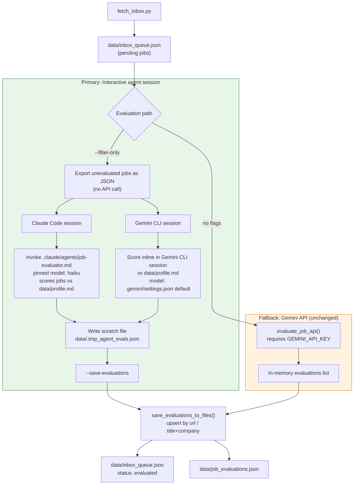

## Context

See proposal.md - Why. Two relevant facts shape this design:

- `tools/evaluate_jobs_gemini.py` already implements the mechanics needed: `--filter-only` exports unevaluated jobs as JSON (no API call), and `--save-evaluations <path>` merges an evaluations JSON array back into `data/inbox_queue.json` / `data/job_evaluations.json` via `save_evaluations_to_files()`. Neither is currently wired into any command or skill.
- The repo maintains a full parallel structure for two interactive agents: `.claude/{commands,skills}/` for Claude Code and `.gemini/{commands,skills,prompts}/` + `.gemini/GEMINI.md` for Google's Gemini CLI. Both currently point at the same no-flag (Gemini API) invocation and both need the same fix so either agent can run the workflow live.

## Workflow Diagram

`model` field set on each record: `claude-agent-session` (Claude Code path, scored via the `.claude/agents/job-evaluator.md` subagent pinned to Haiku 4.5), `gemini-agent-session` (Gemini CLI path, scored inline using whatever model `.gemini/settings.json` specifies), or the Gemini model name e.g. `gemini-2.5-flash` (API fallback path).

## Goals / Non-Goals

**Goals:**
- Make interactive-agent evaluation (Claude Code or Gemini CLI) the default path exercised by every fetch/scan-inbox entry point on both sides of the repo.
- Keep the evaluation record schema and the merge/upsert behavior byte-for-byte compatible with what `job_search_tracker.csv` and the `upskill` skill already consume.
- Preserve the Gemini API path as a working fallback with zero code changes.

**Non-Goals:**
- No changes to `tools/evaluate_jobs_gemini.py`'s Python logic, CLI flags, or the evaluation JSON schema itself — this change only rewires which invocation path each command/skill uses.
- No unification of the differing scoring rubrics used elsewhere in the repo (e.g. `job-application-assistant`'s Strong/Good/Moderate/Weak/Poor framework) — out of scope for this change.
- No new `.claude/skills/scan-inbox` skill to mirror the Gemini-side one — that asymmetry predates this change and isn't part of it.
- No batch/unattended scheduling support — this change is specifically about live, in-session evaluation for low-volume, interactive use.

## Decisions

**Reuse the existing `--filter-only` / `--save-evaluations` round trip as-is rather than adding new flags.** The tool already does exactly what's needed; the only gap is that no command/skill invokes it this way. Adding new flags or a new script would duplicate logic that already exists and is already documented in `tools/README_EVALUATE_JOBS_GEMINI.md`.

**Route the agent's in-progress evaluations through a scratch JSON file, not an inline `--save-evaluations` argument.** `main()` supports both (`--save-evaluations` accepts a path or falls back to `json.loads()` on the raw argument), but passing a JSON array of several jobs' worth of evaluation data as a single CLI argument risks hitting Windows command-line length limits and shell-quoting issues. A scratch file (e.g. `data/.tmp_agent_evals.json`, overwritten each run) avoids both.

**Tag evaluations by evaluator identity (`claude-agent-session` / `gemini-agent-session`) instead of a single generic tag like `interactive-agent-session`.** `tools/summarize_evals.py` already filters on the `model` field to report on a specific evaluation batch (it previously did this for the `Antigravity-Agent-Session` heuristic run). Keeping the two interactive agents distinguishable preserves that capability and makes it possible to spot evaluator-specific quality drift later.

**Update both `.claude/*` and `.gemini/*` files in the same change rather than doing Claude Code first and Gemini CLI in a follow-up.** The user explicitly wants both supported as primary immediately; leaving one side on the old API-only path would mean the two entry points behave inconsistently in the interim.

**Delegate Claude-Code-side scoring to a dedicated `.claude/agents/job-evaluator.md` subagent pinned to Haiku 4.5, rather than scoring inline in the orchestrating session.** Scoring a job against the fixed 5-dimension rubric is structured, mechanical work — it doesn't need Sonnet/Opus-level reasoning — so pinning a cheap, fast model keeps evaluation cost low and predictable regardless of what model the user's main interactive session happens to be running. This mirrors the existing pattern in `.claude/agents/gemini-research-expert.md`, which already pins its own subagent to a specific model (`sonnet`) for its purpose. **Gemini CLI has no equivalent lever**: `.gemini/settings.json` sets one global `model` key for the whole CLI session (currently `gemini-2.5-flash`), and there is no `.gemini/agents/` subagent concept in use in this repo. The Gemini CLI side therefore continues to score inline in the main session, using whatever model `.gemini/settings.json` specifies — this asymmetry is accepted as a consequence of the two tools' differing architectures, not treated as a gap to close in this change.

**Leave the Gemini API code path completely untouched.** It already works end-to-end and is documented; the only problem was that it was the default path called by every command/skill. Removing it was considered and rejected by the user (see proposal.md - Why) given past reliability issues make it worth keeping as a fallback rather than a dependency of last resort that's also been deleted.

**Add validation function to `tools/evaluate_jobs_gemini.py` to check evaluation records before persistence, with partial-save and tracking.** Rather than silently dropping or completely blocking malformed batches, the `save_evaluations_to_files()` function SHALL: (1) validate each record against the JSON schema (see `specs/job-evaluation/spec.md`), (2) save valid records immediately to `data/inbox_queue.json` and `data/job_evaluations.json`, (3) track invalid records in `data/job_evaluations.failed.json` with error details, and (4) report a summary to stderr at end of session. This prevents agent hallucinations from corrupting the evaluation data (valid records are safe) while preserving all work for visibility and post-session retry via a separate follow-up skill. Validation is a **blocking check** for schema compliance (required fields, types, ranges, fit_category values) and a **logging check** for recommended consistency validations (overall_fit computed correctly, fit_category matches overall_fit thresholds, arrays non-empty, timestamps valid).

## Risks / Trade-offs

- **Invalid records don't corrupt persisted data** → invalid records are tracked separately in `data/job_evaluations.failed.json` with error details, but valid records are saved immediately to `inbox_queue.json` and `job_evaluations.json`. This prevents agent hallucinations from breaking a batch (97 good jobs still persist even if 3 are malformed), while preserving all work for visibility and post-session retry. Users see a summary at the end of each session; a separate follow-up skill (`fix-failed-evals`, out of scope for this change) will handle re-evaluation of failed jobs.
- **Two model tags fragment the `model` field** where downstream tooling might assume a single value → `tools/summarize_evals.py` and any future reporting must treat `claude-agent-session` and `gemini-agent-session` as equally valid "agent-evaluated" provenance, not just check for one string. This is a documentation/instruction concern, not a code change, since neither script currently hard-codes a specific expected value beyond the one historical `Antigravity-Agent-Session` filter.
- **Subagent invocation adds a layer of indirection on the Claude Code side** (one Agent-tool call per evaluation run instead of scoring inline) → mitigation: the command/skill instructions should batch all exported jobs into a single subagent invocation per run, not one call per job, keeping overhead to one extra round trip rather than N.
- **Six-plus markdown files changing in lockstep** across `.claude/` and `.gemini/` risk drifting out of sync over time (as they already have — e.g. the Gemini side has a `scan-inbox` skill the Claude side lacks). Mitigation: none required for this change beyond keeping the edits parallel; deeper consolidation is out of scope (see Non-Goals).

## Migration Plan

1. Update the six-plus command/skill/prompt files (see proposal.md - Impact) to the new 3-step round trip; no data migration needed since the evaluation record schema is unchanged.
2. No changes required to already-persisted data in `data/inbox_queue.json` / `data/job_evaluations.json` — existing `gemini-2.5-flash`-tagged records remain valid and untouched.
3. Rollback, if needed, is a plain revert of the markdown changes — the Python tool and data files are never touched, so there is no rollback risk there.
