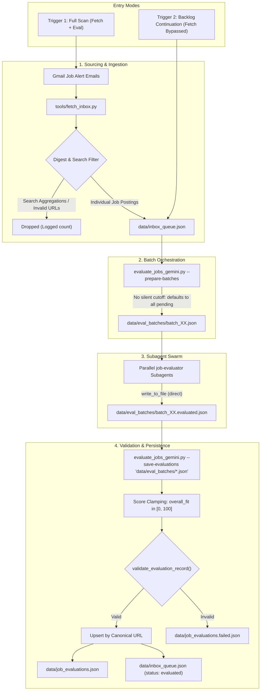
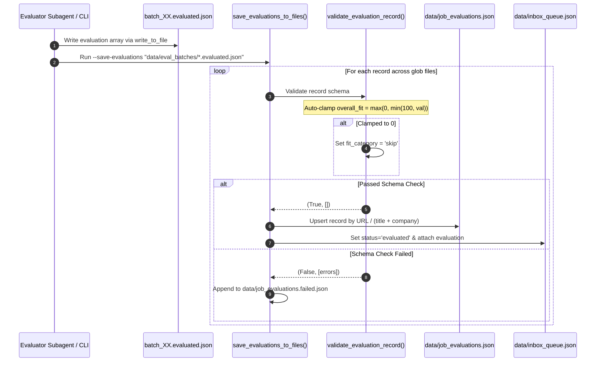

## Context

See `proposal.md` for motivation. Currently, `tools/fetch_inbox.py` extracts alert links and pushes them directly to `data/inbox_queue.json`, where search aggregations like "10,000+ Director Jobs" slip through as single jobs. During evaluation, `evaluate_jobs_gemini.py` processes jobs sequentially in API mode or exports them raw via `--filter-only`. A silent default of `--days 14` cuts off older pending jobs, and agents instructed to run the workflow after bypassing fetch mistakenly assume they should evaluate only "today's" alerts. The subagents return JSON into conversation transcripts, which requires complex parsing. Finally, strict validation in `save_evaluations_to_files()` rejects records with negative `overall_fit` caused by high `red_flags` deductions.

## Goals / Non-Goals

**Goals:**
- Drop non-posting search digest links during Gmail ingestion in `tools/fetch_inbox.py`.
- Add `--prepare-batches` to `tools/evaluate_jobs_gemini.py` to partition the queue into balanced batch JSON files (default 60 jobs) for subagent execution.
- Auto-clamp `overall_fit` (and individual dimensions) to `[0, 100]` in `validate_evaluation_record()` to avoid rejecting negative scores.
- Enable glob patterns (e.g. `data/eval_batches/*.evaluated.json`) in `--save-evaluations`.
- Update subagent prompts to write evaluations directly to file rather than printing large JSON blocks in chat.
- Remove silent 14-day date truncation and support explicit queue backlog continuation when fetch is bypassed.

**Non-Goals:**
- Changing candidate profile evaluation criteria or rubric weights (30% skills, 25% experience, 20% company, 15% growth, -10% red flags).
- Building an automated daemon or background scheduler (evaluations remain user-triggered).
- Modifying the web dashboard or tracker CSV schema.

## Decisions

### 1. Ingestion-time search digest filtering in `fetch_inbox.py`
- **Decision**: Filter out items whose titles match search aggregations (e.g. `^\d+[\d,]*\+\s+.*Jobs`) or whose URLs point to general search endpoints (`/jobs/search`, `keywords=`, `origin=JOB_ALERT_IN_SEARCH`).
- **Rationale**: Prevents junk entries from ever polluting `data/inbox_queue.json` (saving ~13% of queue volume).
- **Alternatives considered**: Filtering during evaluation. Rejected because junk entries accumulate in queue status metrics and waste tokens.

### 2. Auto-clamping score values to [0, 100] in validation
- **Decision**: In `validate_evaluation_record()`, clamp all dimension scores and `overall_fit` to `max(0, min(100, val))` before running schema boundary checks. If clamped to 0, automatically assign `fit_category: "skip"`.
- **Rationale**: When an irrelevant job receives 100% on `red_flags`, the -10% penalty drives `overall_fit` negative. Clamping ensures valid arithmetic without manual data repair.
- **Alternatives considered**: Rejecting negative scores and requiring subagents to re-score. Rejected because subagents correctly identified the job as 100% red-flagged junk.

### 3. Native Batch Preparation CLI (`--prepare-batches`)
- **Decision**: Add `--prepare-batches` with options `--days <N>` and `--batch-size <N>` (default 60) to `tools/evaluate_jobs_gemini.py`. Writes `data/eval_batches/batch_00.json`, etc., and prints subagent invocation prompts.
- **Rationale**: Standardizes subagent preparation, reducing orchestrator turns and eliminating manual Python slicing scripts.
- **Alternatives considered**: Embedding full subagent orchestration inside Python. Rejected because subagent invocation is handled by the interactive agent session (`invoke_subagent`).

### 4. Glob pattern support in `--save-evaluations`
- **Decision**: Support glob patterns (e.g. `data/eval_batches/*.json` or directory paths) in `--save-evaluations`.
- **Rationale**: Subagents each write their output file (`batch_00.evaluated.json`); a single CLI command then merges all results atomically.
- **Alternatives considered**: Merging file-by-file sequentially. Rejected because sequential runs incur repeated file I/O on `data/inbox_queue.json`.

### 5. Subagent Direct File Output
- **Decision**: Update `.agents/agents/job-evaluator.agent.md` and `.claude/agents/job-evaluator.md` prompts to instruct the subagent to use `write_to_file` to save evaluations directly to `data/eval_batches/batch_XX.evaluated.json`.
- **Rationale**: Completely removes transcript regex scraping, escaping bugs, and transcript bloat.

### 6. Queue Backlog Continuation & Removing Silent Date Truncation
- **Decision**: In `tools/evaluate_jobs_gemini.py`, if `args.days is None` and neither `start_date` nor `end_date` are specified, do not default to 14 days; process all pending unevaluated jobs in the queue (`days_val = None`). In workflow prompts (`.gemini/prompts/scan_inbox_workflow.md`, `prompts/scan_inbox_workflow.md`, etc.), add explicit instructions:
  *"If skipping or bypassing the fetch step, do not restrict evaluation to today; inspect `data/inbox_queue.json` and evaluate all pending jobs (`status: 'pending_evaluation'`) across all dates or the desired window."*
- **Rationale**: Prevents accidental omission of pending backlog and stops agents from mistakenly scoping evaluation to "today" when fetch is skipped.
- **Alternatives considered**: Adding a separate `--backlog` flag. Rejected because unevaluated jobs in `data/inbox_queue.json` already represent the backlog, so defaulting to all pending jobs when no date is passed is simpler and less error-prone.

## Risks / Trade-offs

- **[Risk]** Over-aggressive title filtering in `fetch_inbox.py` could drop a legitimate job posting that happens to contain digits in its title.  
  → **Mitigation**: Strictly anchor regex to beginning of title with count indicators (`^\d+[\d,]*\+\s+`) and require the word "Jobs".
- **[Risk]** Subagent fails to call `write_to_file` and prints JSON in chat as fallback.  
  → **Mitigation**: Keep the CLI's existing string-JSON parsing capability as fallback in `--save-evaluations`.
- **[Risk]** Running evaluation with no date filter on an enormous queue could select hundreds of jobs unexpectedly.  
  → **Mitigation**: `--prepare-batches` accepts `--days N` whenever scoping is desired, but `--filter-only` and `--prepare-batches` clearly log the total candidate count and date filter before proceeding.
