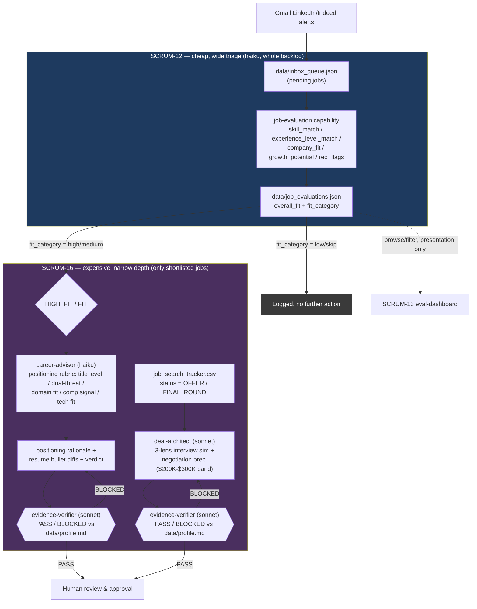

# SCRUM-12 / SCRUM-16 Funnel

Cheap, wide triage (SCRUM-12) feeds expensive, narrow depth (SCRUM-16) — they answer different questions and don't duplicate each other. See `design.md` for the full rationale.

The two `{{ }}` diamonds are the `evidence-verifier` gate (`specs/evidence-verification/spec.md`) — a third, independent subagent that checks every claim in a draft against `data/profile.md` before either `career-advisor` or `deal-architect`'s output reaches you.
