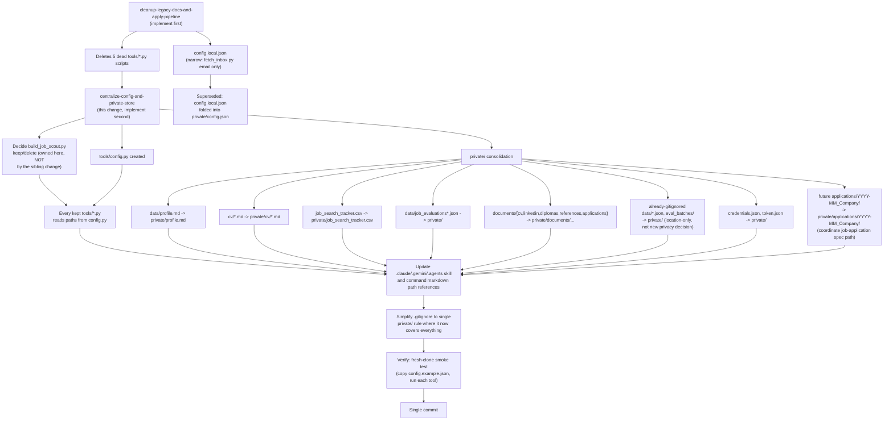

## Context

See `proposal.md` - Why. This change is explicitly sequenced *after* the sibling `cleanup-legacy-docs-and-apply-pipeline` change (not yet implemented): that change deletes five confirmed-dead `tools/*.py` scripts (no point wiring dead code into a new config module) and introduces a narrower `config.local.json` fix (its task 2.8) scoped to just `tools/fetch_inbox.py`'s Gmail email. This change generalizes that into a full config module covering every path every kept script hardcodes today (full inventory below), folds the sibling's job-search-email config into it rather than keeping two separate config files, **and owns `tools/build_job_scout.py`'s keep/delete decision** — the sibling change explicitly leaves that file untouched (2026-09-22 scoping clarification), so this change decides its fate rather than inheriting a decision from elsewhere.

Current hardcoded path literals across `tools/*.py` (grepped 2026-09-22; scripts marked `[DEAD]` are deleted by the sibling change and excluded from this change's scope):
- `credentials.json`, `data/token.json` — OAuth (fetch_inbox.py, build_job_scout.py)
- `data/inbox_queue.json`, `data/job_evaluations.json`, `data/job_evaluations.failed.json`, `data/fetch_state.json` — evaluation pipeline (fetch_inbox.py, evaluate_jobs_gemini.py, generate_mockup.py, `[DEAD]` evaluate_jobs.py/evaluate_past_week.py/print_data_ai_roles.py/summarize_evals.py)
- `data/profile.md`, `data/master_resume.md` — candidate data (evaluate_jobs_gemini.py, build_job_scout.py, `[DEAD]` evaluate_jobs.py/evaluate_past_week.py)
- `job_search_tracker.csv` — application tracking (evaluate_jobs_gemini.py, generate_mockup.py)
- `salary_data.json` — salary_lookup.py, convert_salary_excel.py
- `CLAUDE.md` — build_job_scout.py (writes it as part of its original bootstrap/scaffold role — see `cleanup-legacy-docs-and-apply-pipeline`'s audit note on what this script actually is)

User confirmed (2026-09-22, via direct question) two decisions that determine scope: `data/job_evaluations.json` moves into `private/` despite not being classic identity PII (treated as sensitive-by-association with the profile it's derived from), and `documents/`'s personal subfolders move into `private/documents/` too, replacing their current protection (granular per-path `.gitignore` rules) with the same single-folder rule as everything else.

## Goals / Non-Goals

**Goals:**
- One gitignored directory (`private/`) holds every artifact carrying real personal or job-search data. No second "this is also private but protected a different way" pattern survives in the repo after this change.
- One Python module (`tools/config.py`) is the single place every kept tool resolves a path or a personal setting from. No `tools/*.py` file contains a hardcoded personal path literal after this change.
- A fresh clone with `config.example.json` copied to `private/config.json` and populated is enough to run every tool — no script needs source edits to work for a new user/fork.
- Consistent with the sibling change's "if you plan to publish your fork" README callout: the answer becomes "don't commit `private/`," not a checklist of individual files.
- **Decide `tools/build_job_scout.py`'s fate** (deferred here by the sibling change, not resolved yet by anyone) — it's a one-time repo-scaffold/bootstrap generator (it embeds the entire original `CLAUDE.md` content as a string and writes it out, among other files), not a recurring operational tool. Present that finding to the user for an explicit keep/delete call before touching its config wiring, mirroring the sibling change's own checkpoint pattern rather than assuming.

**Non-Goals:**
- Rewriting *what* any tool does — this is a path/config refactor, zero behavior change to evaluation logic, Gmail querying, or dashboard rendering.
- Changing `.claude/`/`.gemini/`/`.agents/` skill or command markdown content beyond the file paths they reference in prose (e.g. `.claude/skills/job-application-assistant/*.md` mentions of `data/profile.md`, `cv/`, `job_search_tracker.csv` need updating to the new paths, but their instructional content doesn't change).
- Implementing the sibling change's LaTeX-deletion/doc-rewrite scope — that stays entirely in `cleanup-legacy-docs-and-apply-pipeline`.

## Decisions

### Decision 1: Config data lives in `private/config.json`, config code lives in `tools/config.py`
**Chosen**: The Python module (`tools/config.py`, tracked, no personal data — just path-resolution logic) is separate from the config *data* (`private/config.json`, gitignored, holds the actual job-search email and any future personal setting). A tracked `config.example.json` template lives at repo root (not inside `private/`, so it stays visible/trackable without needing a `.gitignore` negation rule) showing the expected shape; setup copies it to `private/config.json` and fills it in.
**Rationale**: Once a file lives inside `private/` (entirely gitignored), the `*.local.json` naming convention used elsewhere in this repo (`credentials.json` at root, `.claude/settings.local.json`) becomes unnecessary — the directory itself is the privacy signal. Keeping the example template outside `private/` avoids a `.gitignore` negation rule (`!private/config.example.json`), which is easy to get wrong and easy to accidentally commit real data next to by mistake.
**Alternative (declined)**: A `.env` file + `python-dotenv` — rejected, same reasoning as the sibling change's Decision 5: this repo has no existing `.env` convention and already uses local JSON files for exactly this purpose.

### Decision 2: `tools/config.py` exposes resolved paths, not just raw settings
**Chosen**: `tools/config.py` provides both the loaded settings (e.g. `config.job_search_email`) and pre-resolved `pathlib.Path` constants for every relocated file (e.g. `config.PROFILE_PATH`, `config.INBOX_QUEUE_PATH`, `config.JOB_SEARCH_TRACKER_PATH`), all rooted under a single `config.PRIVATE_DIR` constant.
**Rationale**: If every script independently joins `config.PRIVATE_DIR` with its own relative string, the path literal problem just moves one level down instead of disappearing — a typo'd join in one script still diverges from another's. Centralizing the *paths themselves*, not just the base directory, means a future reorganization touches one file.
**Alternative (declined)**: Export only `PRIVATE_DIR` and let each script build its own paths — rejected for the reason above.

### Decision 3: Full `private/` consolidation, not partial
**Chosen** (per user decisions above): every personal/job-search artifact moves into `private/`, including already-gitignored operational files (`data/token.json`, `data/fetch_state.json`, `data/inbox_queue.json`, `data/scratch_*.json`, `data/eval_batches/`) — not just the newly-decided `job_evaluations.json` and `documents/` content. This isn't a new privacy decision for those files (they're already excluded from git today); it's applying the same location-consistency logic the user just confirmed for the two ambiguous cases. End state: `data/` as a directory is retired entirely — nothing sharable was found living there that doesn't also belong in `private/`.
**Rationale**: Leaving some already-private files in `data/` and others in `private/` after this change would recreate exactly the "two patterns for the same concern" problem this change exists to eliminate, just with the boundary redrawn instead of erased.
**Alternative (declined)**: Only move what was explicitly asked about, leave already-gitignored `data/*.json` alone — rejected as inconsistent with the change's own stated goal.
**Amendment (2026-09-23, found during implementation)**: `data/positioning_rubric.md` (tracked, non-personal — the `headhunter-agent` change's scoring rubric, added after this design was written) does not retire from `data/`. It isn't personal data, so it doesn't belong under `private/`, and the user confirmed leaving it in place rather than relocating it and updating its four referencing files. End state is therefore "`data/` contains no personal data," not "`data/` is empty/removed."

### Decision 4: `documents/README.md` stays at its current tracked location
**Chosen**: `documents/README.md` (instructions for `/setup` Path A) and the top-level `documents/` folder structure stay where they are and stay tracked; only the *personal content* underneath (`cv/`, `linkedin/`, `diplomas/`, `references/`, `applications/`) moves to `private/documents/{cv,linkedin,diplomas,references,applications}/`.
**Rationale**: `documents/README.md` is public-facing setup instructions, not personal data — it tells a new user what to place where. Moving instructional scaffolding into a gitignored folder would make it invisible to a fresh clone, defeating its purpose.
**Alternative (declined)**: Move the whole `documents/` tree including README — rejected, breaks onboarding for new users/forks who need to read that file before they have anything private to put anywhere.

## Sequencing

## Risks / Trade-offs

| Risk | Mitigation |
|------|-----------|
| A file move breaks a script that references the old path somewhere not caught by the `tools/*.py` grep inventory (e.g. inside a `.claude/skills/*.md` prose instruction an agent follows, not code) | Separate task to grep `.claude/`, `.gemini/`, `.agents/` markdown for every old path string (`data/profile.md`, `cv/`, `job_search_tracker.csv`, `documents/cv`, etc.) after the code changes, not just the Python files |
| Large single change touches many files at once (higher review burden, harder to bisect if something breaks) | Sequenced strictly after the sibling change lands (smaller, already-reviewed diff to build on); migration plan below is ordered so each step is independently verifiable (move + update references + smoke-test per group) rather than one giant atomic move |
| A future script reintroduces a hardcoded path out of habit (old patterns are sticky) | This change's README/SETUP note (coordinate with sibling change's doc rewrite) should state the `tools/config.py` convention explicitly so it's discoverable, not just inferred from reading other scripts |
| `private/` directory already exists with a stale duplicate `credentials.json` in it (per sibling change's audit) — moving the *live* root `credentials.json` into `private/` after the sibling change already deleted the stale duplicate avoids a collision, but only if sequencing is respected | Explicit sequencing dependency stated in proposal.md and this design; do not implement this change before the sibling change's task 2.4 (delete `private/credentials.json` duplicate) is done |

## Migration Plan

1. Confirm `cleanup-legacy-docs-and-apply-pipeline` is implemented (dead scripts deleted, its `config.local.json` task 2.4/2.8 done — `tools/build_job_scout.py` explicitly left untouched by that change) — hard prerequisite, not a suggestion.
2. Decide `tools/build_job_scout.py`'s fate (this change's own decision — see Goals above), before creating config-module tasks that depend on the answer.
3. Create `tools/config.py` with `PRIVATE_DIR` and every resolved path constant; create tracked `config.example.json` at repo root.
4. Move files into `private/` group by group, updating each group's readers immediately after moving (not all at once): OAuth files -> profile/CV -> evaluation data -> tracker -> documents/ personal subfolders -> already-gitignored operational data.
5. Update every kept `tools/*.py` (including `build_job_scout.py` if kept per step 2) to import from `tools/config.py` instead of hardcoding paths.
6. Grep `.claude/`, `.gemini/`, `.agents/` for every old path string and update prose references (commands, skills) to the new `private/`-rooted paths.
7. Update the sibling change's still-open `job-application` delta spec: change `applications/YYYY-MM_Company/` to `private/applications/YYYY-MM_Company/` (only if that change hasn't been archived yet; if it has, edit `openspec/specs/job-application/spec.md` directly instead).
8. Simplify `.gitignore`: remove now-redundant individual personal-data rules once their target lives under `private/`; keep the single `private/` rule and all non-personal-data rules untouched.
9. Fresh-clone smoke test: in a scratch clone (or after temporarily renaming `private/` and `config.example.json`-derived `private/config.json`), verify `python tools/fetch_inbox.py`, `python tools/evaluate_jobs_gemini.py ...`, and `python tools/generate_mockup.py` all run without a source edit, using only `config.example.json` -> `private/config.json` + re-authenticating.
10. Single commit.
11. Rollback: git revert; no data loss since `private/` was already gitignored (nothing tracked is destroyed, only relocated).
