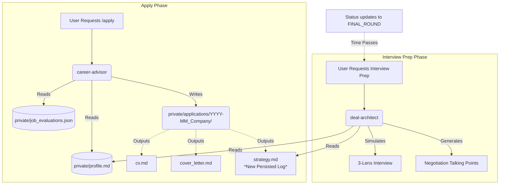

## Context

See `proposal.md` for the motivation. Currently, the `career-advisor` generates a strategic positioning report for opportunities and emits it to the user. This data is structured but ephemeral.

### Workflow Architecture

## Goals / Non-Goals

**Goals:**
- Persist the strategic reasoning generated during the `/apply` phase.
- Ensure the `deal-architect` agent can discover and consume this persisted reasoning.

**Non-Goals:**
- Do not change the underlying rubrics used to generate the strategy.
- Do not apply this retroactively to already-archived job applications (unless manually generated).

## Decisions

- **Format**: We will use `strategy.md` (Markdown format) instead of JSON. 
  - *Rationale*: Markdown is highly readable for the user in their `private/applications/` folder alongside `cv.md` and `cover_letter.md`. The LLM agents (like `deal-architect`) are already highly proficient at reading and extracting structured info from Markdown files.
  - *Alternatives considered*: `strategy.json`. While slightly safer for programmatic extraction, it is less human-readable. Given the user regularly reviews application materials, Markdown is superior.
- **Workflow Hook**: The `career-advisor` agent (or the `job-application` workflow orchestrator) will intercept the generated positioning rationale and write it directly to the designated application directory at the same time it writes `cv.md`.
- **Pre-flight Check**: The `deal-architect` simulation script will execute a pre-flight check for the existence of `strategy.md` in the target application directory and load its contents into the LLM context if found.

## Risks / Trade-offs

- [Risk] **Stale Context**: A user might manually update their `cv.md` but forget to update the `strategy.md` to reflect their new angle.
  - *Mitigation*: Emphasize to the LLM during interview prep that `strategy.md` is the original starting point, but the candidate's live answers should take precedence.
