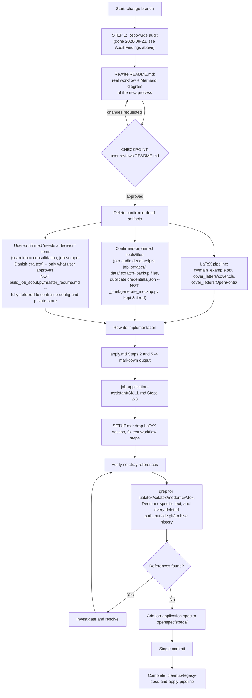

## Context

See `proposal.md` - Why. This is a follow-up to the archived `2026-09-22-cleanup-stale-fork-artifacts` (SCRUM-17) change, which checked off its README/SETUP rewrite tasks without the file contents actually matching the current workflow. The decision to delete (not archive) the LaTeX pipeline was confirmed directly by the user during this change's proposal step, closing the "pending user decision" the SCRUM-17 design.md left open.

Current repo-root remote is `https://github.com/iourichadour/ai-job-search-private.git` (confirmed via `git remote -v`) — README.md's "Fork and clone" step currently still points at `MadsLorentzen/ai-job-search`, the original upstream fork source, which is wrong for this repo's own contributors.

## Goals / Non-Goals

**Goals:**
- Before deleting anything, run one repo-wide audit for stale/orphaned artifacts beyond the already-known LaTeX pipeline, so a single review catches everything instead of trickling out across future sessions (this is literally how the LaTeX contradiction was missed by SCRUM-17 — no one scanned past the two files SCRUM-17 already knew about).
- Turn that audit into an updated `README.md` (with a Mermaid diagram) describing only the real, current-intended workflow, and treat the user's review of that README as the gate before any deletion happens.
- Every doc file (`README.md`, `SETUP.md`) and every implementation file (`apply.md`, `job-application-assistant/SKILL.md`, `05-cv-templates.md`, `06-cover-letter-templates.md`) agrees on one workflow: Gmail alerts -> fit evaluation -> markdown CV/cover letter in `applications/YYYY-MM_Company/`.
- `openspec/specs/job-application/spec.md` becomes the durable source of truth for `/apply`'s behavior, so future changes (starting with `headhunter-agent`, SCRUM-16) reference a spec instead of re-deriving behavior from prose docs that can drift again.
- Deletion of the LaTeX pipeline (and whatever else the audit confirms as dead) is total and verifiable (no dangling references), matching the verification pattern SCRUM-17 used (grep for stale references before closing) — but this time run *after* an explicit inventory, not relying on the author's memory of what's stale.
- No personal PII (specifically: the maintainer's real email address) is hardcoded into tracked source files, and anyone reading this repo's README before publishing/open-sourcing their own fork gets an explicit list of which files carry real personal data.

**Non-Goals:**
- Building a markdown -> PDF rendering step (e.g. Pandoc) as a replacement for LaTeX's PDF output. Out of scope; the user chose plain deletion, not a replacement toolchain. If PDF output is wanted later, that's a new change.
- Implementing anything from the `headhunter-agent` change (SCRUM-16) itself. This change only removes the ambiguity blocking it.
- Touching `/setup`, `/expand`, `/reset`, or the `documents/` folder layout — SCRUM-17's design.md explicitly deferred this to a separate follow-up ("Phase 2"), and nothing found during this change's investigation makes it newly in-scope. (The audit below does touch `/scan-inbox` and the `job-scraper` skill, which are new findings, not part of that deferred Phase 2 list.)
- Creating a Jira ticket. Left for the user per `proposal.md` - Impact.
- Deciding, without the user, whether any "needs a decision" item in the audit below gets deleted. This design records the findings; the README checkpoint is where the user confirms what actually gets dropped.

## Repo-Wide Audit Findings (2026-09-22)

Full inventory of `.claude/`, `.gemini/`, `.agents/`, and top-level directories, cross-referenced by grepping every skill/command/doc for references to each candidate file. Two buckets:

### Confirmed orphaned (zero live references outside git/archive history)
- `job_scraper/` (top-level) — contains only `.gitkeep` and a gitignored `seen_jobs.json`; leftover empty shell from the pre-Gmail-alert Danish scraper era that SCRUM-17's code deletion didn't fully clean up.
- `tools/evaluate_jobs.py` — zero references; superseded by `tools/evaluate_jobs_gemini.py` (26 live references).
- `tools/evaluate_past_week.py` — zero references.
- `tools/print_data_ai_roles.py` — zero references.
- `tools/refetch_jobs_browser.py` — zero references.
- `tools/summarize_evals.py` — referenced only from an *archived* change's design.md (`openspec/changes/archive/2026-09-17-interactive-agent-job-evaluation/design.md`), not from any live skill/command.
- Duplicate `credentials.json`: an identical (byte-for-byte, same timestamp) copy exists at repo root and at `private/credentials.json`. Both are gitignored, so this isn't a leak. **Resolved 2026-09-22**: `tools/fetch_inbox.py` reads `credentials.json` from the repo root by relative path (`InstalledAppFlow.from_client_secrets_file('credentials.json', SCOPES)`), so root is the live copy; `private/credentials.json` is the redundant one, safe to delete (see tasks.md 2.4).
- `data/` accumulated scratch/backup artifacts: `inbox_queue.json.bkp.json`, eight timestamped `scratch_*.json` files, `evaluated_jobs_summary.md` — transient debug output from past runs, not referenced by any current skill as an input.
- `prompts/scan_inbox_workflow.md` (top-level; distinct from the still-live `.gemini/prompts/scan_inbox_workflow.md`) — referenced only from archived changes, not any live command.

### Reversed: kept, not deleted (2026-09-22)
- `_brief/mockup.html`, `_brief/report-spec.md`, `tools/generate_mockup.py` — **not dead.** Initially flagged as zero-reference orphans (true at the time — nothing in `.claude/`/`.gemini/`/`.agents/`/`openspec/` pointed to them), but investigation showed `generate_mockup.py` is a real, working interim dashboard generator tied to the pending `eval-dashboard` OpenSpec change (its `_brief/report-spec.md` is a design brief for the same "evaluations + applied-jobs tracker" idea `eval-dashboard` proposes, just never cross-referenced). User asked to keep and fix it rather than delete it. Fixed 2026-09-22 (see `tools/generate_mockup.py` git history for the before/after): removed several hardcoded placeholder KPI values (a fake "68%"/"76%"/"88%"/"82%"/"85%", a fabricated tech-stack chart, and a broken model-name-casing filter that silently dropped most of `data/job_evaluations.json`'s 875 records) and replaced them with values computed live from `data/job_evaluations.json` and `job_search_tracker.csv`. Verified rendering correctly in-browser across all three tabs with real data (875 evals, 236 high-fit, 1 real tracked application) and zero console errors. See `openspec/changes/eval-dashboard/design.md` - Interim Artifact for how this relates to that change's fuller planned dashboard.

### Deferred entirely to a follow-up change (2026-09-22 scoping clarification)
- `tools/build_job_scout.py` ("job scout setup") — **not decided in this change at all**, not even conditionally. Originally listed as "needs a decision" here, but the user asked to keep it intact and defer everything about it — keep/delete status, its hardcoded-email fix (see Security finding below), and its path/config handling — to the `centralize-config-and-private-store` change instead. This change makes zero edits to `tools/build_job_scout.py`.
- `data/master_resume.md` — deferred alongside `build_job_scout.py` for the same reason: its only consumer is the deferred script, so evaluating its redundancy against `data/profile.md` in isolation (without also deciding the script's fate) doesn't produce a stable answer. Also untouched by this change.

### Needs a user decision (real but undocumented, duplicated, or contradicting CLAUDE.md)
- **Three overlapping "fetch + evaluate inbox" pathways** exist side by side: `/fetch-inbox` (the one `CLAUDE.md` actually names), `.claude/commands/scan-inbox.md` (near-identical pipeline, mirrored into `.gemini/skills/scan-inbox/` and `.agents/skills/scan-inbox/`, never mentioned in `CLAUDE.md` or README's Quick Start), and the `job-scraper` skill (natural-language-triggered — "Evaluate inbox jobs" / `/scrape` — also reads `inbox_queue.json` and does its own fetch+assess pass). Worth consolidating to one documented path.
- `.claude/skills/job-scraper/search-queries.md` still contains the sentence *"The framework's built-in CLI tools (jobindex, jobbank, etc.) are Denmark-specific"* — a direct leftover reference to the CLI tools SCRUM-17 already deleted. This is more Danish-era content than just README/SETUP had.

### Security/open-source hygiene finding (2026-09-22, user-flagged)
`grep -rn "iouri.chadour@gmail.com" $(git ls-files)` (excluding one binary font false-positive) hits 10 tracked files. Two different categories:
- **Expected** (a resume needs contact info): `data/profile.md`, `.claude/skills/job-application-assistant/01-candidate-profile.md`, `cv/*.md`, `cv/main_example.tex` (pending deletion anyway).
- **Not expected — hardcoded into source logic**: `tools/fetch_inbox.py:344` and `tools/build_job_scout.py:153` both bake the literal address directly into the Gmail search query string (`gmail_query = f"from:(jobalerts-noreply@linkedin.com OR alert@indeed.com OR iouri.chadour@gmail.com) after:{after_epoch}"`). This is wrong independent of open-sourcing — config values don't belong in source — and means a fork/PR/screenshot of that file leaks the address, and every other user of a fork would need to hand-edit Python to use their own. **This change fixes only `tools/fetch_inbox.py`** (see Decision 5) — `tools/build_job_scout.py`'s instance is deferred to `centralize-config-and-private-store` per the "Deferred entirely" bucket above, so it will still contain the hardcoded literal after this change lands; that's expected, not a miss. Also present in the planning doc `documents/plans/email.process.plan.md` (not code, lower priority, not in scope for either change).

## Decisions

### Decision 1: Delete the LaTeX pipeline outright, no legacy/ archive folder
**Chosen**: Delete `cv/main_example.tex`, `cover_letters/cover.cls`, `cover_letters/OpenFonts/` and the LaTeX guidance in `05-cv-templates.md`/`06-cover-letter-templates.md`.
**Rationale**: Confirmed directly by the user in this change's proposal step, after discussing the LaTeX-vs-markdown tradeoff (ATS parsing risk of moderncv's multi-column layout, toolchain fragility already documented in `SETUP.md`'s troubleshooting section, and that markdown resumes in `cv/*.md` are already the real, currently-used artifacts). Git history fully preserves the deleted files if PDF output is wanted again later.
**Alternative (declined)**: Move to `legacy/` instead of deleting — rejected by the user in favor of a clean deletion.

### Decision 2: `job-application` becomes a new spec'd capability, not a docs-only change
**Chosen**: Add `openspec/specs/job-application/spec.md` capturing `/apply`'s post-cleanup behavior (fit gate, markdown output, output location, reviewer loop, no-fabrication rule).
**Rationale**: `/apply` has never been spec'd despite being one of two core workflow commands (the other, inbox ingestion/evaluation, already has `inbox-ingestion` and `job-evaluation` specs). The SCRUM-17 pattern of "mark docs rewritten, but nothing enforces they match reality" is exactly what caused this change to be necessary in the first place — a spec gives the next change (`headhunter-agent`) and any future doc rewrite something authoritative to check against, rather than repeating the drift.
**Alternative (declined)**: Treat this purely as a docs/dead-code refactor with `skip_specs: true`, matching SCRUM-17's own precedent. Rejected because the LaTeX -> markdown change to `/apply` output IS a real behavior change (different file extension, different output directory, different/removed compile-and-inspect step), not just internal implementation detail — `openspec validate` would also reject a zero-delta change here since real observable behavior changes.

### Decision 3: Fix the fork-clone origin to this repo's actual remote
**Chosen**: `README.md`'s "Fork and clone" step should reference `iourichadour/ai-job-search-private` (confirmed via `git remote -v`), not `MadsLorentzen/ai-job-search`.
**Rationale**: This repo is a private working repo, not a template others fork from; the upstream-fork instructions are leftover boilerplate from the original template repo and mislead a reader of this repo's own README (e.g. a future agent session bootstrapping context) about where the code lives.
**Alternative (declined)**: Keep crediting `MadsLorentzen/ai-job-search` as the clone source in Quick Start while only keeping it in Acknowledgements — rejected because Quick Start should describe how to get *this* repo, not the ancestor template; the Acknowledgements section already covers attribution correctly and is untouched by this change.

### Decision 4: `_brief/`/`tools/generate_mockup.py` reversed from "delete" to "keep and fix"
**Chosen**: Keep `_brief/mockup.html`, `_brief/report-spec.md`, `tools/generate_mockup.py`; do not delete them despite the initial zero-reference audit finding.
**Rationale**: The audit's "no live references" signal was correct but insufficient — it only checked whether skills/commands/docs pointed at the files, not whether the files themselves were useful or tied to other planned work. On inspection, `generate_mockup.py` was a real, working dashboard generator with several data bugs (hardcoded placeholder KPIs, a broken model-name-casing filter), tied to the same goal as the pending `eval-dashboard` change. User asked to fix rather than discard it, since they want a working dashboard to review tracking now, not only after `eval-dashboard`'s larger implementation lands.
**Alternative (declined)**: Delete per the original audit — rejected; would have thrown away a working, wanted tool because a reference-grep can't tell "orphaned" apart from "useful but never cross-linked."

### Decision 5: De-hardcode the personal email into a gitignored config file, not an env var
**Chosen**: Add `config.local.json` (gitignored, matching the existing `*.local.json` pattern already in `.gitignore` — no gitignore change needed) holding `{"job_search_email": "..."}`, read by `tools/fetch_inbox.py` at runtime (**not** `tools/build_job_scout.py` — deferred, see above). Add a matching "if you plan to publish/open-source your fork" callout to `README.md` listing every file that carries real personal data.
**Rationale**: User flagged (2026-09-22) that if this repo is ever open-sourced, contributors/forkers should never be exposing their actual email address by way of this project's own code — and investigation found it's already hardcoded into `tools/fetch_inbox.py`'s live Gmail query logic today, not just a hypothetical future risk. A JSON config file matches this repo's existing convention (`credentials.json`, `data/token.json`, `.claude/settings.local.json` are all gitignored local files already) better than introducing a new `.env`/`python-dotenv` dependency the project doesn't otherwise use.
**Alternative (declined)**: Environment variable (`JOB_SEARCH_EMAIL=...`) — rejected only because it's a second, inconsistent config mechanism next to the existing local-JSON-file convention; not a wrong approach in general, just not this repo's pattern.

## Technical Approach

**Workflow rationale**: SCRUM-17 went straight from "I know about these two files" to deletion, and never re-scanned before marking itself done — which is exactly how the LaTeX docs and the Danish-era sentence in `job-scraper/search-queries.md` survived it. This change inverts the order: audit everything first, turn the audit into a README the user can actually review as a single artifact, and only delete what's confirmed after that review. The reference grep still runs at the end as a final safety net, but it's no longer the *only* check — the upfront audit is.

## Risks / Trade-offs

| Risk | Mitigation |
|------|-----------|
| Deleting LaTeX files breaks something referencing them that wasn't found during investigation | Grep verification step (mirrors SCRUM-17's own verification pattern) before considering the change complete; git history preserves full recovery path |
| Rewriting `apply.md`'s drafting/revision steps changes real workflow behavior other in-flight work depends on | `headhunter-agent` (SCRUM-16) is still in planning, not implemented, so no other change currently depends on `/apply`'s LaTeX output; `eval-dashboard` and `agy-job-evaluator-subagent` don't touch `/apply` |
| New `job-application` spec drifts from `apply.md`'s actual prose again, repeating the SCRUM-17 failure mode | Spec scenarios are written to be checkable against `apply.md`'s actual steps as part of this same change's task list, not left for a future change to reconcile |
| The audit itself missed something (grep-based reference checking can't catch every implicit dependency, e.g. a human running a tool manually from memory) | The README checkpoint gives the user a chance to flag anything the audit got wrong before deletion, rather than deleting straight off the audit's own confidence |
| `config.local.json` doesn't exist yet on a fresh checkout, so `tools/fetch_inbox.py` would crash confusingly after the de-hardcoding fix if run without setup | The loader raises a clear, actionable error naming the missing file/key (task 2.8); `config.local.example.json` is tracked so the fix is copy-and-edit, and SETUP.md 5.7 documents the step explicitly |

## Migration Plan

1. **(Done 2026-09-22)** Repo-wide audit for stale/orphaned artifacts — see Audit Findings above.
2. Rewrite `README.md` to describe only the real, current-intended workflow (Gmail alerts -> evaluate -> markdown `/apply`), with a Mermaid diagram of that process. This is the artifact the user reviews.
3. **Checkpoint**: user reviews the rewritten `README.md` and confirms which Audit Findings items to actually delete (confirmed-orphaned bucket is expected to be approved as-is; "needs a decision" bucket requires explicit per-item confirmation).
4. Delete `cv/main_example.tex`, `cover_letters/cover.cls`, `cover_letters/OpenFonts/`; remove the now-empty `cover_letters/` directory if nothing else lives in it
5. Delete whatever else the checkpoint approved from the Audit Findings (confirmed-orphaned bucket, plus any approved "needs a decision" items)
6. Add `config.local.json` handling: create `config.local.example.json`, add a loader to `tools/fetch_inbox.py` only, replace the hardcoded `iouri.chadour@gmail.com` literal there with the loaded value (`tools/build_job_scout.py` is untouched — deferred to `centralize-config-and-private-store`)
7. Rewrite `.claude/commands/apply.md` Steps 2 and 5 for markdown output to `applications/YYYY-MM_Company/`; drop the SCRUM-17 contradiction note now that it's resolved
8. Rewrite `.claude/skills/job-application-assistant/SKILL.md` Steps 2-3, `05-cv-templates.md`, `06-cover-letter-templates.md` for markdown
9. Rewrite `SETUP.md`: drop LaTeX installation/compile/troubleshooting sections, fix "Test the workflow", replace the thin "Gmail Account with Job Alerts" note with real "create a dedicated Gmail account" + "configure Gmail API access" subsections including the `config.local.json` step (see tasks.md 5.7 for the exact steps, verified against `tools/fetch_inbox.py`'s actual OAuth implementation)
10. Add an "if you plan to publish/open-source your fork" callout to `README.md` listing every file with real personal data (tasks.md 5.8)
11. Add `openspec/specs/job-application/spec.md` via the standard archive-sync step (or copy the change's delta spec directly, consistent with how `inbox-ingestion`/`job-evaluation` were established)
12. Grep for `lualatex|xelatex|moderncv|\.tex\b|MadsLorentzen|jobindex|jobbank|iouri.chadour@gmail.com` (the last restricted to `.py` files; plus the specific paths of anything deleted in steps 4-5) across tracked files (excluding `.git/` and `openspec/changes/archive/`) and resolve any remaining hits
13. Single commit
14. No rollback needed beyond git revert; all deleted content remains recoverable via history
