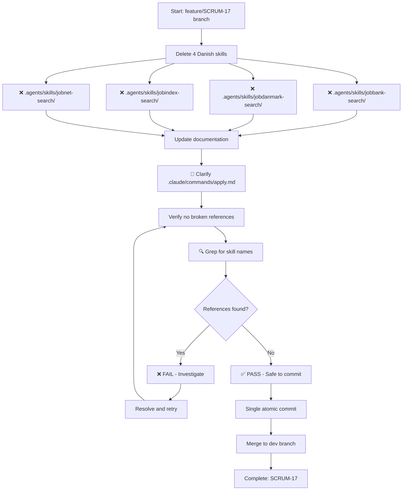

## Context

The project has evolved from a Danish job-portal scraping workflow to a Gmail-alert-based sourcing system. The original fork from MadsLorentzen/ai-job-search included CLI tools for four Danish portals (JobBank, JobDanmark, JobIndex, JobNet), but these are no longer invoked anywhere in the active workflow (see RESUME.md, "Confirmed dead"). The `/apply` command's implementation contradicts the behavior documented in CLAUDE.md, creating maintenance confusion and increased cognitive load when reasoning about the workflow.

## Goals / Non-Goals

**Goals:**
- Remove all unused Danish job-portal scrapers (`jobbank-search`, `jobdanmark-search`, `jobindex-search`, `jobnet-search` skills)
- Clarify `/apply` command to align with CLAUDE.md's one-line description or document the actual full pipeline
- Reduce repository size and maintenance surface
- Preserve full git history for audit/recovery

**Non-Goals:**
- Remove onboarding commands (`/setup`, `/expand`, `/reset`) or `documents/` folder in this change (scope deferred; documented as separate followup)
- Archive to a separate branch or external repo (git history is sufficient)
- Rewrite `/apply`'s full implementation in this change (scope limited to alignment clarification)

## Technical Approach

The cleanup follows a sequential workflow to minimize risk and ensure verification at each step:

**Workflow rationale**:
1. Delete all four skills atomically (no intermediate partial states)
2. Update docs to resolve CLAUDE.md contradiction
3. Verify no stray references to deleted code
4. Single commit captures the entire cleanup as one cohesive change
5. Git history fully preserved for audit and recovery

## Decisions

### Decision 1: Direct Deletion vs. Archive
**Chosen**: Direct deletion with git history preserved.
**Rationale**: These tools are confirmed dead (no references, no users); removing them directly unblocks future work without ceremony. Git history survives full inspection if needed; no value in archiving to a side branch.
**Alternative**: Archive to `openspec/archive/` — would add process overhead without benefit for dead code.

### Decision 2: Deletion Order
**Chosen**: Delete all four skills as a single atomic commit, then update documentation.
**Rationale**: Avoids intermediate partial states and reduces cross-checking complexity. A single "remove stale skills" commit is easier to reason about and revert if needed.
**Alternative**: Delete one at a time — adds no value and complicates git history.

### Decision 3: `/apply` Clarification Approach
**Chosen**: Update `.claude/commands/apply.md` to document the actual full LaTeX pipeline (CV drafter, cover letter, PDF compilation) explicitly, marking it as superseded in favor of a simpler markdown-resume approach if that is the user's intent, OR simplify the command entirely to match the CLAUDE.md description.
**Rationale**: This change unblocks future work; the `/apply` full pipeline is genuinely useful for some workflows, but its contradiction with CLAUDE.md needs resolution.
**Alternative (deferred)**: Remove the full pipeline and implement a minimal markdown resume drafter — requires scope clarification from user; defer to `/apply` simplification change.

## Risks / Trade-offs

| Risk | Mitigation |
|------|-----------|
| Breaking external references to the four skills | Minimal — these skills are not documented in CLAUDE.md or MEMORY.md; no external workflow depends on them. Confirmed in RESUME.md. Deletion is safe. |
| Partial deletion breaks intermediate states | Atomic commit removes all four at once; no half-baked intermediate state. |
| `/apply` clarification incomplete | Scope limited to updating documentation to match reality; the actual simplification/rewrite is a separate change. Current change provides accurate documentation. |

## Migration Plan

1. Delete directories: `.agents/skills/{jobbank-search,jobdanmark-search,jobindex-search,jobnet-search}/`
2. Update `.claude/commands/apply.md` to document the actual full pipeline with a note about ongoing clarification (link to a followup openspec change if it exists)
3. Single commit: `chore(SCRUM-13): remove dead Danish job-portal scrapers, clarify /apply pipeline`
4. No rollback needed (git history is fully recoverable)

## Open Questions

None — scope is clear, dependencies are identified, risk is low. Proceed with implementation.
