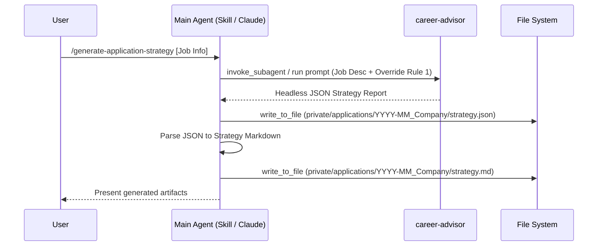

## Context

See `proposal.md` for the motivation. The `add-application-strategy-log` change previously introduced the `strategy.md` file as a required input for the `deal-architect` simulation, but tied its creation to the `/apply` workflow. We need to decouple it into an independent skill.

## Goals / Non-Goals

**Goals:**
- Provide an Antigravity skill (`.agents/skills/generate-application-strategy/SKILL.md`) to invoke `career-advisor` and persist `strategy.md`.

**Non-Goals:**
- Do not modify the existing `/apply` workflow (it can continue to generate `strategy.md` natively when drafting).
- Do not modify `career-advisor`'s system prompt or output schema.

## Decisions

- **Architecture**: We will implement this as a skill with dual compatibility for both Antigravity (`.agents/skills/generate-application-strategy/SKILL.md`) and Claude Code (`.claude/skills/generate-application-strategy.md` or equivalent), enabling cross-agent delegation.

The skill instructions will instruct the agent to:
  1. Extract company name and job details from the prompt.
  2. Call `invoke_subagent` (or Claude's equivalent) with the `career-advisor` agent, overriding its instruction to read from `job_evaluations.json` by simply providing the job description inline.
  3. Wait for the `career-advisor`'s JSON output.
  4. Save the raw JSON report to `private/applications/YYYY-MM_Company/strategy.json`.
  5. Parse the output into a markdown document following the standard strategy log template.
  6. Write the markdown to `private/applications/YYYY-MM_Company/strategy.md` (creating the folder if needed).
- **Subagent Overrides**: `career-advisor`'s first rule expects a `job_evaluations.json` entry. We will provide a prompt to `career-advisor` that explicitly includes the job description and asks it to ignore rule 1.

## Risks / Trade-offs

- [Risk] **Agent Compliance**: `career-advisor` might refuse to run without a `job_evaluations.json` entry despite the explicit override in the prompt.
  - *Mitigation*: If the subagent strictly refuses, the skill will instruct the main agent to temporarily write a mock evaluation to a scratch file and point the subagent to it, or the skill can simply instruct the main agent to do the evaluation itself using `career-advisor`'s rubric. We will try the prompt override first.
