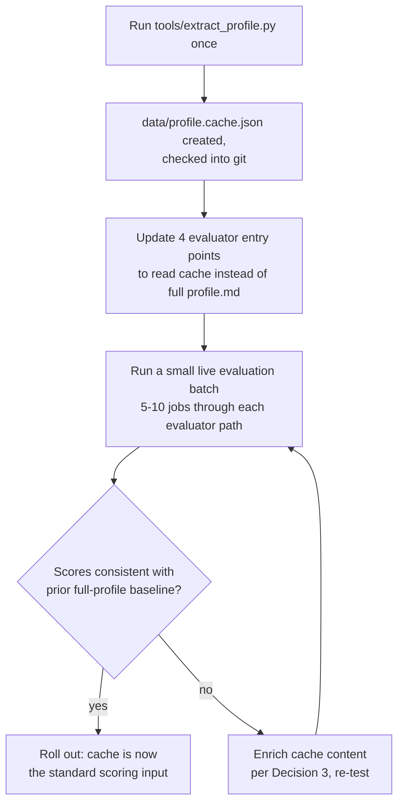

## Context

See `proposal.md` - Why / What Changes for motivation and scope. Relevant current state:
- `data/profile.md` is read in full by four separate entry points: `.claude/agents/job-evaluator.md`, `.agents/agents/job-evaluator.agent.md`, `.gemini/GEMINI.md` (interactive-agent paths, each instructing its evaluator to "read `data/profile.md`"), and `tools/evaluate_jobs_gemini.py`'s `load_profile()` → `evaluate_job_api()`, which embeds the full profile text into every per-job prompt (once per job, not once per batch — the most redundant of the four).
- `data/profile.md` is already dense and list-based (139 lines), not verbose prose, so a naive "summarize with an LLM" approach isn't warranted and isn't what's proposed — extraction is rule-based (plain parsing of known Markdown section headers/bullets), per the proposal.
- The scoring rubric (`openspec/specs/job-evaluation/spec.md`) scores five dimensions: `skill_match`, `experience_level_match`, `company_fit`, `growth_potential`, `red_flags`. `company_fit` and `growth_potential` draw on `data/profile.md`'s narrative sections (Behavioral Profile, Key AI-Driven Projects, "What Excites You", "Thrives In"), not just list-style facts — this constrains how much the cache can safely compress.

## Goals / Non-Goals

**Goals:**
- Cut redundant token cost of re-sending the full profile on every evaluator invocation, especially the Gemini API fallback's per-job embedding.
- Guarantee evaluators never silently score against a profile cache that has drifted from `data/profile.md`.
- Keep the change mechanical and low-risk: no rubric, weighting, or record-schema changes.

**Non-Goals:**
- Not moving `data/profile.md` or the new cache under `private/` — that relocation belongs to `centralize-config-and-private-store` if/when it lands; this change keeps both files at their current `data/` paths and leaves relocation to whichever change lands second.
- Not building an LLM-based summarizer — extraction is deterministic, rule-based parsing only, per the proposal.
- Not attempting to preserve 100% of `data/profile.md`'s prose fidelity in the cache — some compression of the job-history section is an intentional trade-off (see Decisions).

## Decisions

### 1. Freshness check: content hash, not mtime
`tools/extract_profile.py` computes a SHA-256 hash of `data/profile.md`'s contents and stores it as `_meta.source_hash` inside `data/profile.cache.json`, alongside `_meta.generated_at`. A separate `--check` flag re-hashes the current `data/profile.md` and compares against `_meta.source_hash`, exiting non-zero (and printing a clear message) if they differ or if the cache file doesn't exist.

**Why over mtime**: file modification times are not reliably preserved across `git clone`/`checkout` (a fresh checkout can give every file the same or an arbitrary mtime), which would make an mtime-based check either useless or actively wrong right after a clone. A content hash is correct regardless of checkout history.

### 2. Regeneration is automatic where the caller is code, instructed where the caller is an agent prompt
- **Gemini API fallback** (`tools/evaluate_jobs_gemini.py`): before loading the cache, it runs the equivalent of `extract_profile.py --check`; if stale or missing, it regenerates automatically (extraction is deterministic and cheap — there's no reason to make a human do this by hand) and prints a one-line notice that it did so, then proceeds. This satisfies the "surface, don't silently proceed" requirement via a visible log line rather than a hard block, since auto-regeneration removes the actual risk (stale data) without adding friction.
- **Interactive-agent paths** (`.claude/agents/job-evaluator.md`, `.agents/agents/job-evaluator.agent.md`, `.gemini/GEMINI.md`): each agent's instructions are updated to, as their first step, run `python tools/extract_profile.py --check` via their shell tool, and if it reports stale/missing, run `python tools/extract_profile.py` (no flags) to regenerate before reading `data/profile.cache.json`. This keeps behavior identical across all three agent runtimes without needing each one to embed extraction logic itself.

**Alternative considered**: require a manual `python tools/extract_profile.py` step as part of any `data/profile.md` edit workflow, with evaluators simply failing on a stale cache. Rejected — adds a step a future session will forget, for a check that's cheap to make self-healing.

### 3. Cache content: condense job history, keep rubric-relevant narrative near-verbatim
The cache is not a fully re-structured metadata blob (skills-as-array, companies-as-array, etc. with everything else dropped) — that would flatten the narrative content `company_fit` and `growth_potential` actually score against. Instead:
- **Condensed** (structured/shortened): `Professional Experience` — keep the current role in full, collapse the four earlier roles (2001-2020) into one condensed line each (title, company, dates, one-line summary) since seniority trend, not full bullet history, is what `experience_level_match` needs from older roles. `Education` and `Certifications` become one compact line each.
- **Kept near-verbatim**: `Core Technical Competencies`, `Key AI-Driven Projects`, `Behavioral Profile` (all subsections), `What Excites You`, `Target Roles & Industries`, `Deal-Breakers` — these map directly onto `skill_match`, `company_fit`, `growth_potential`, and `red_flags` and are already concise bullet lists in the source, so there's little to gain and real quality risk in compressing them further.

Expected result: cache is meaningfully smaller than the source (job-history section is the single largest block in `data/profile.md`) without touching the sections the two hardest-to-score dimensions depend on.

### 4. Extractor fails loudly on unrecognized structure
`extract_profile.py` parses `data/profile.md` by matching its current `##`/`###` section headers by name (`## Core Technical Competencies`, `## Deal-Breakers`, etc.). If a future edit to `data/profile.md` adds, renames, or removes a section the extractor doesn't recognize, `extract_profile.py` SHALL exit non-zero with a message naming the unrecognized/missing section, rather than silently omitting it from the cache. This is the same "surface, don't silently degrade" principle as the freshness check, applied to structural drift instead of staleness.

## Risks / Trade-offs

- **[Risk] Compressing job history could lose a nuance `experience_level_match` needs from an older role** → Mitigation: the condensed line for each pre-2020 role keeps title, company, dates, and one summary line — enough to establish seniority trajectory; if a future evaluation run shows this dimension degrading, the fix is enriching those condensed lines, not reverting the whole cache.
- **[Risk] Narrative sections (`company_fit`/`growth_potential` inputs) still get slightly reformatted even where "kept near-verbatim"** → Mitigation: these sections are copied with only whitespace/formatting normalization, no rewording, minimizing drift from the source meaning.
- **[Risk] Four separate entry points must all be updated consistently, or evaluators silently diverge (some reading the cache, some still reading the full file)** → Mitigation: `tasks.md` updates all four in one change; verification step greps for `data/profile.md` across `.claude/`, `.agents/`, `.gemini/` after the change to confirm none of the evaluator instruction files still reference it directly.
- **[Trade-off] Auto-regeneration on staleness (Decision 2) means a bad/malformed edit to `data/profile.md` gets baked into the cache automatically rather than requiring a human to notice and re-run manually** → Accepted: `extract_profile.py`'s own structural-drift check (Decision 4) is the safety net for malformed input; a well-formed but substantively-wrong profile edit is a user error the cache mechanism isn't meant to catch.

## Migration Plan

No rollback complexity: if the cache approach needs to be abandoned, the four entry points revert to pointing at `data/profile.md` directly (single-line change each) and `data/profile.cache.json` / `tools/extract_profile.py` are simply left unused or deleted. No data migration, no schema change to `data/inbox_queue.json` or `data/job_evaluations.json` is involved at any point.

## Open Questions

None — the freshness mechanism, cache content boundary, and entry-point list are all decided above.
