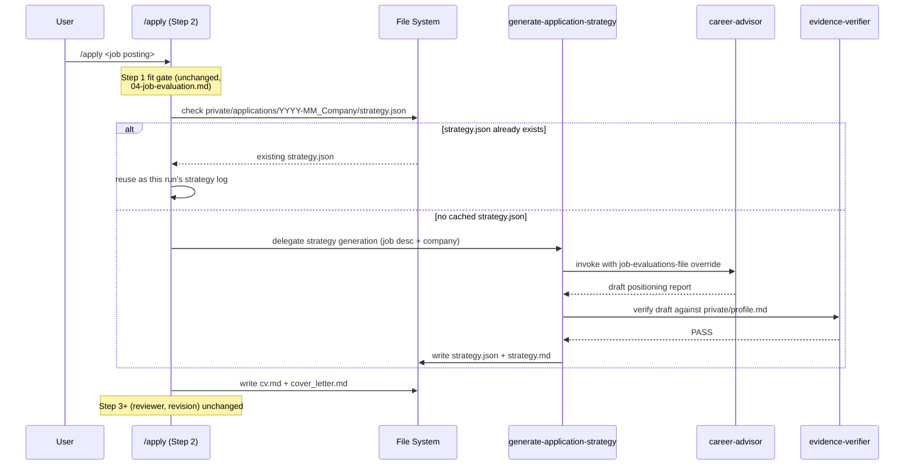

## Context

See `proposal.md` for motivation. `/apply` (`.claude/commands/apply.md`) and the standalone `generate-application-strategy` skill (`.agents/skills/generate-application-strategy/SKILL.md`, `.claude/skills/generate-application-strategy.md`) both currently produce `strategy.md`, but only the skill's path runs `career-advisor` (scored against `data/positioning_rubric.md`) and `evidence-verifier`. `deal-architect` already reads `strategy.md`/`strategy.json` generically and needs no change.

## Goals / Non-Goals

**Goals:**
- Make `/apply`'s strategy log as rigorous as the standalone skill's, by routing both through the same generation path.
- Avoid paying for `career-advisor` + `evidence-verifier` more than once per application folder when nothing has changed.

**Non-Goals:**
- No automatic staleness detection (profile/JD hashing, mtime comparisons). Regeneration is either "file absent" or "user explicitly asked."
- No consolidation of `/apply`'s Step 1 fit gate (`04-job-evaluation.md`) with `job-evaluator`'s or `career-advisor`'s rubrics — those remain three separate, intentionally distinct evaluations.
- No changes to `career-advisor`, `evidence-verifier`, `deal-architect`, or the skill's own standalone behavior.

## Decisions

**Decision: `/apply` delegates to the skill's flow instead of absorbing `career-advisor`'s rubric into its own Step 1.**
Considered replacing `/apply`'s fit-evaluation gate with `career-advisor`'s positioning rubric outright (deeper unification). Rejected: that gate answers "should I apply" (04-job-evaluation.md) while `career-advisor` answers "how do I position" (positioning_rubric.md) — different questions, and collapsing them would change the go/no-go gate's behavior for no benefit to the actual problem (strategy-log inconsistency). Keeping the gate untouched is the minimal change that fixes the inconsistency.

**Decision: cache key is file existence, not content hash.**
Before invoking `career-advisor`, `/apply` checks whether `private/applications/YYYY-MM_Company/strategy.json` exists. Present -> reuse. Absent -> generate. This mirrors the `profile-caching-optimization` change's precedent of deferring automatic freshness detection as unnecessary complexity at current (low) application volume — a manual "please refresh" request is sufficient signal to regenerate.

**Decision: `/apply` sources the URL from its own Step 0 extraction, not a new lookup.**
`/apply` already extracts company name and role from the job posting in Step 0; when the input is a URL (the common case — pasted LinkedIn/Indeed link), that URL is already in hand. The delegation call to the skill passes it through explicitly, and the skill's prompt to `career-advisor` includes it so the output schema's `url` field gets set instead of defaulting to `""`. If `/apply` was invoked with pasted text and no URL, `url` stays legitimately blank — this decision only fixes the case where a URL was available but silently dropped, not cases where none exists.

**Decision: the two entry points default differently.**
- `/apply`: defaults to **reuse** if a strategy log already exists for the folder. Its typical case is a brand-new company folder anyway; the check only matters for the cross-entry-point overlap (skill ran first for this company).
- Standalone skill: defaults to **regenerate** unconditionally. A user invoking the skill directly is already giving the explicit "generate/refresh this" signal — no separate reuse check needed there.

## Risks / Trade-offs

- [Risk] **Silent staleness**: without hash/mtime checks, if a candidate's `profile.md` changes materially after a strategy log was cached, `/apply` will keep reusing the stale strategy for that company folder until someone manually asks for a refresh.
  - *Mitigation*: acceptable at current application volume (few applications, infrequent profile changes); revisit with automatic freshness detection only if this becomes a recurring problem, consistent with how `profile-caching-optimization` deferred the same complexity.
- [Risk] **`/apply` now costs 2 more subagent calls (`career-advisor`, `evidence-verifier`) on the common case of a brand-new application**, versus today's free ad hoc write.
  - *Mitigation*: this is the unavoidable one-time cost of getting rubric-scored, verified strategy content — the caching only removes *repeat* cost, not first-time cost. Accepted as the intended trade-off of this change.
